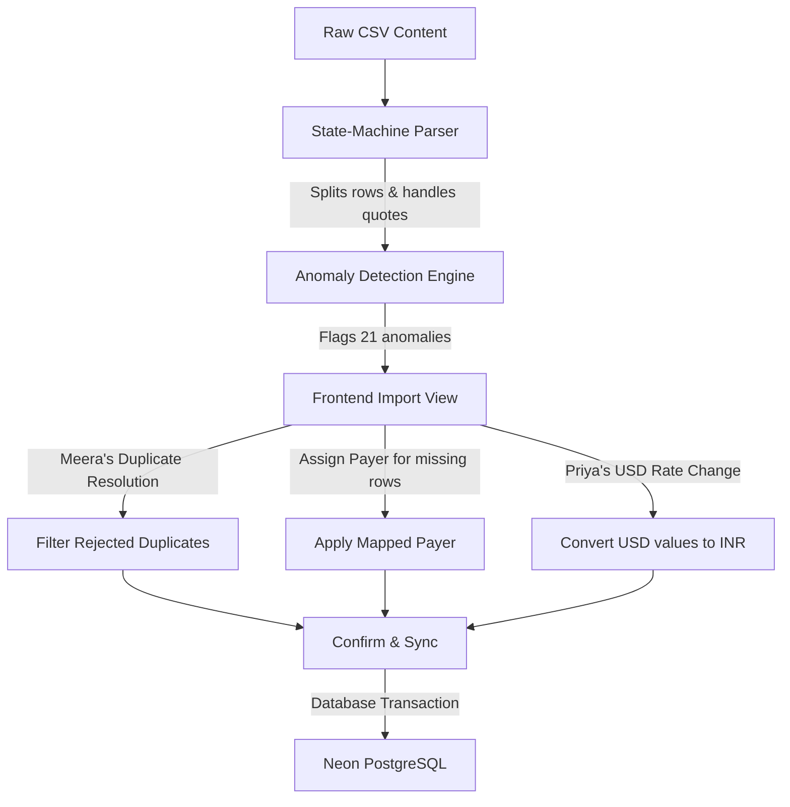

# WORKFLOW.md — User Journeys & Data Flows

This document maps out the system workflows, ingestion pipelines, and user journeys within the Shared Expenses App.

---

## 1. Data Ingestion Pipeline (CSV parsing)

---

## 2. Interactive User Journeys

### Journey 1: Ingesting the CSV (The Evaluator / User)
1. **Load data:** User clicks "One-Click Import Local CSV" or uploads their own CSV file.
2. **Review anomalies:** The **Anomaly Resolution Center** opens, listing date, currency, duplicate, and timeline issues.
3. **Map missing payers:** Payer for Row 13 (blank) is selected from a dropdown.
4. **Choose duplicate winners:** User reviews double-logged dinner entries side-by-side, toggling which duplicate to skip or keep.
5. **Set USD rate:** User enters an exchange rate (e.g. 83.0), converting Goa flight expenses.
6. **Commit to DB:** User clicks "Write to Neon DB", executing a SQL transaction to initialize all flatmates, timelines, and transactions.

### Journey 2: Aisha's Debt Settlement Check
1. **Open Dashboard:** Aisha navigates to the Dashboard tab.
2. **View pathways:** Under "Aisha's Settlement Pathway", she sees the simplified direct transfer routes (e.g. "Rohan pays Aisha ₹2,300").
3. **Settle debts:** Aisha pays or receives exactly what is shown, clearing the flat's entire balance in minimal transfers.

### Journey 3: Rohan's Audit Check ("No Magic Numbers")
1. **Open Ledger:** Rohan navigates to the "Rohan's Ledger" tab.
2. **Select Name:** Rohan selects "Rohan" from the member grid.
3. **Audit Ledger:** Rohan views the chronological ledger table. He sees every rent payment, Swiggy order, and Goa villa booking, checking his share of costs and net balance effect.
